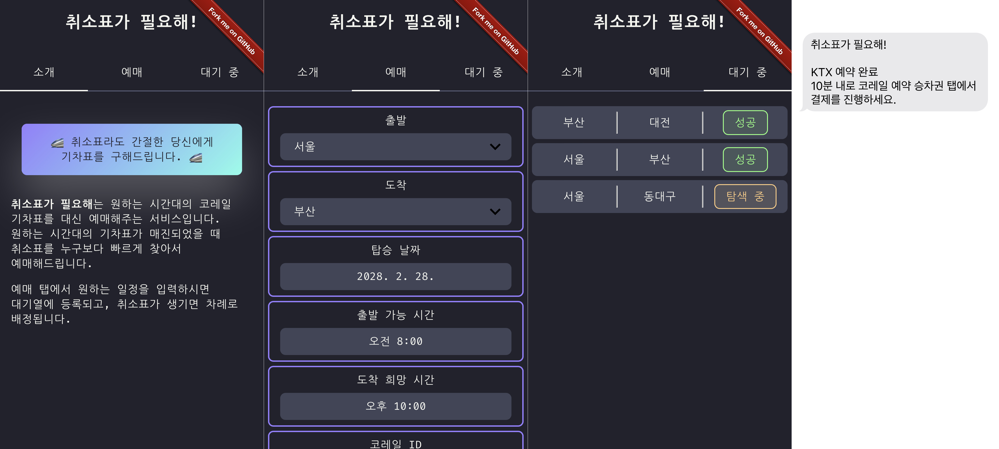

<h1 align="center">취소표가 필요해!</h1>

<div style="overflow-x: auto;" align="center">
  
  <p>
    <a target="_blank" href="https://cancel4me.netlify.app">보러가기</a> &mid;
    <a href="#diy">자신의 서버에서 실행하기</a>
  </p>
</div>

> 취소표라도 간절한 당신에게 기차표를 구해드립니다

**취소표가 필요해**는 원하는 시간대의 코레일 기차표를 대신 예매해주는
서비스입니다. 원하는 시간대의 표가 매진되었을 때 취소표를 누구보다 빠르게 발견해
예매해드립니다.

## :gear: 내 서버에 올리기

**취소표가 필요해**를 자신의 서버에 올려 사용하고 싶으시다면 아래 설명을
따라주세요.

<a id="diy"></a>
### 0. 프로젝트 클론

```bash
git clone https://github.com/gim-hangil/cancel4me
```

### 1. 프론트엔드 설치

```bash
cd web
npm install
npm build
```

### 2. 백엔드 설치

```bash
cd server
python -m venv venv
source venv/bin/activate
pip install -r requirements.txt
```

### 3. 필요한 환경 변수 설정

필요한 환경변수 목록은 아래와 같습니다.

**필수**
- `REACT_APP_API_HOST` : 백엔드가 동작하고 있는 서버의 주소. 스키마를 포함해서 적어야하고, 마지막 슬래시는 적으면 안 된다.
- `CORS_ALLOW_URL` : 백엔드에 CORS를 허용할 주소의 목록. 콤마로 구분해서 여러 주소를 적을 수 있다. 필수적으로 프론트엔드 서버의 주소를 추가해야 동작한다.
- `DATABASE_URL` : 데이터베이스 주소. `sqlite:///./db.sqlite3` 와 같은 형식으로 로컬 DB를 사용할 수 있다.

**부가**\
SMS를 통한 알림 서비스에 활용되는 환경변수로, 없어도 크래시가 일어나지는 않습니다.
- `NCP_ACCESS_KEY` : 네이버 클라우드 플랫폼 ACCESS KEY.
- `NCP_SECRET_KEY` : 네이버 클라우드 플랫폼 SECRET KEY.
- `SENS_SEND_FROM` : 네이버 SENS API에 등록된 발신 번호.
- `SENS_SERVICE_ID` : 네이버 SENS API의 SERVICE ID.

### 4. 실행

```bash
cd web
npm install -g serve
serve build
```

```bash
cd server
source venv/bin/activate
uvicorn api.main:app
```

## :sparkles: 기여하기

오류나 기능에 대한 제보는 [이쪽](https://github.com/gim-hangil/cancel4me/issues)으로 부탁드립니다!
자유롭게 프로젝트를 포크해서 PR 해주셔도 좋습니다.

## :pencil2: 라이선스

[MIT 라이선스](LICENSE)를 따릅니다.

상업적/개인적 이용, 자유로운 수정 및 배포가 가능합니다. 이 소프트웨어를 사용함에
따른 어떠한 손해도 책임지지 않습니다. 세부 사항은 라이선스 문서를 참고해주세요!
